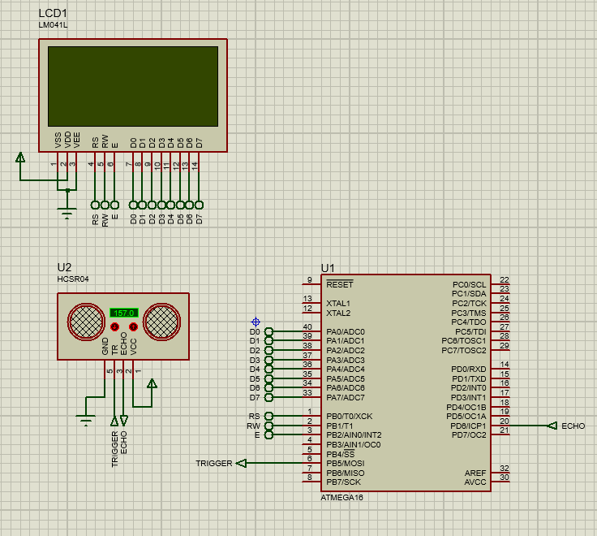

Distance Measurement Project (Embedded System project)

## Project Idea
Process reading from the Ultrasonic Sensor HC-SR04 and calculate the distance, and display it on LCD.

## Drivers used
1. GPIO
2. ICU
3. LCD driver
4. HC-SR04 driver

## Proteus Simulation

